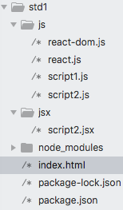
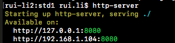
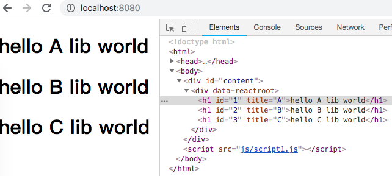
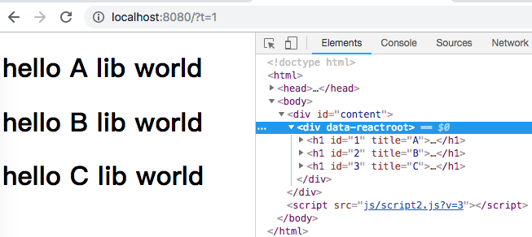

# React基础概念
------
#### 1. React Core 与 React DOM
* React 主要的包有ReactCore和ReactDOM，ReactCore(npm中是react.js)是核心部分，ReactDOM用于挂在元素到网页的DOM组件
* `React.createElement(ele,props,child,child)` 用于创建元素
* `class CHILD extends React.Component{ render(){...}}` 用于创建自定义组件类
* `ReactDOM.render()` 用于渲染组件到真实的DOM中去

#### 2. 属性
* React的属性与HTML属性非常相似，创建组件时，父组件为子组件分配属性。
    - `<TAG_NAME PROPERTY_NAME=VALUE/>` 方式传值
    - 代码中通过`this.props.PROPERTY_NAME` 来访问属性
* 在底层，React属性名称将于标准HTML属性对比，若匹配，则渲染到html元素属性上，若不匹配，则不会渲染，但仍然可以通过`this.props.PROPERTY_NAME`访问。
* 属性值视为组件内不可变的。

#### 3. JSX
* JSX是就js的一种扩展，对React.createElement提供简写方法： <NAME/>
* 使用JSX创建元素：
    - `<name key1=value1 key2=value2><child1/><child2></name>`
* JSX中输出变量使用花括号`{}`，可以在花括号中执行js表达式或者js代码
* JSX中自定义的属性值需要加`data-NAME`前缀
* JSX中使用`if/else`逻辑时，推荐使用三元运算符

#### 4. 第一个React程序
* `mkdir std1 && cd std1` 新建一个文件夹
* 创建如下结构的文件及子文件夹：
    
    

    - index.html作为我们的入口，js文件夹存放react.js和react-dom.js库和新建的script1.js文件，script2.js是由script2.jsx文件转换生成的，不用管它。
* 我们首先不使用JSX方式来创建React组件，在index.html中添加React库和script1.js
```html
<!DOCTYPE html>
<html>
<head>
    <script src="js/react.js"></script>
    <script src="js/react-dom.js"></script>
    <title>std1</title>
</head>
<body>
    <div id="content"></div><!--用于挂在React组件-->
    <script src="js/script1.js"></script>
</body>
</html>
```
```javascript
class HelloWorld extends React.Component { /*组件类HelloWorld继承自React.Component*/

    render(){//render()方法是必须的
        const {lib, ...rest} = this.props;
        return React.createElement('h1',{...rest},'hello ' + lib + ' world');
    }
}

var hw1 = React.createElement(HelloWorld,{id:'1',title:'A',lib:'A lib'});
var hw2 = React.createElement(HelloWorld,{id:'2',title:'B',lib:'B lib'});
var hw3 = React.createElement(HelloWorld,{id:'3',title:'C',lib:'C lib'});

ReactDOM.render(//挂在到真实DOM元素中去
    React.createElement('div',null,hw1,hw2,hw3),
    document.getElementById('content')
)
```
React.createElement方法第一个参数是元素，可以是React自带元素(如：'h1','div','p')与html相同，也可以是自定义组件(如：HelloWorld)。第二个参数是对象形式的属性值。第三个以及后续参数是子元素。上面代码就是创建了一个包含3个HelloWorld的div。每个HelloWorld由一个h1构成。
允许程序时使用本地服务器，这样的好处是可以使用AJAx/XHR请求，按照如下方式安装本地服务器：
    - `sudo npm install -g http-server` 全局安装后进入项目文件夹，输入：`http-server`命令，及可允许起来。
    
    - 
    
* 打开浏览器查看：`localhost:8080`



#### 5. 第一个使用JSX的React程序
* 继续在刚才的目录下添加jsx文件夹和新建一个script2.jsx文件
```javascript
class Hello extends React.Component {
    render(){
        return <h1 id={this.props.id} title={this.props.title}>
        hello  {this.props.lib}  world
        </h1>;
    }
}

ReactDOM.render(
    <div>
        <Hello id='1' title='A' lib='A lib'/>
        <Hello id='2' title='B' lib='B lib'/>
        <Hello id='3' title='C' lib='C lib'/>
    </div>,
    document.getElementById('content')
)
```
Hello组件类直接`return<h1></h1>`，并直接在ReactDOM.render中创建需要返回的DOM，不在需要写大量React.createElement()函数，非常便捷。jsx代码写好后，必须转换成js代码浏览器才可认识。所以我们使用babel工具来转换jsx。
    - 安装`npm install --save-dev babel-cli babel-preset-react`
    - 打开`package.json`添加`"babel": {"presets": ["react"]}`预设。
    - 在`scripts`中添加`"build": "./node_modules/.bin/babel jsx/script2.jsx -o js/script2.js -w"` shell中输入：`npm run build`命令即可将jsx转换为js代码。`-w`是开启babel的watch来实现自动转译。
* 运行结果与例子4中一致（需要将index.html中的script1.js 改为script2.js）



[返回顶端](#React基础概念)