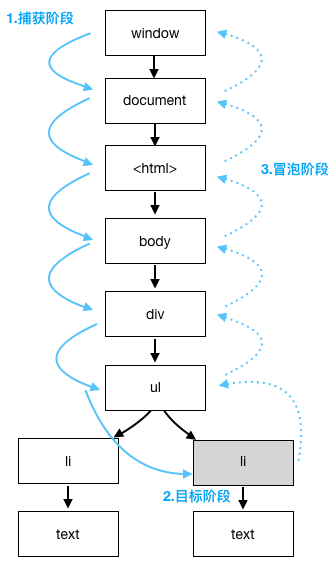
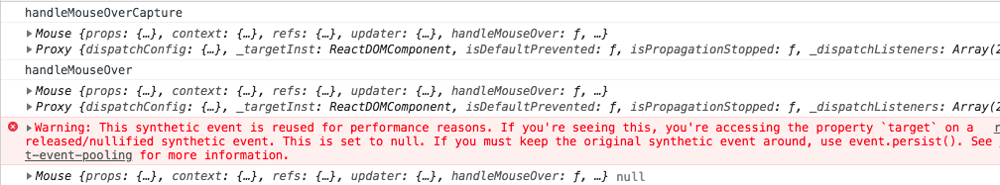
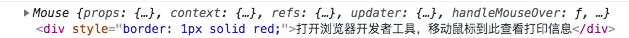
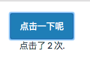
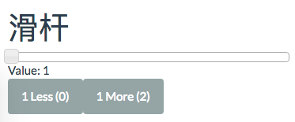

# 事件
------
没有事件处理，则页面仅仅是展现数据，无法响应用户的操作，例如：点击按钮，鼠标拖拽等等。React中的事件处理也非常简单，掌握下面的几点知识即可。

#### 1. 处理DOM事件

* 事件名称以标准驼峰规范命名：例如： `onClick` ，`onMouseOver`
* JSX中事件处理函数作为元素属性值绑定：例如：`<button onClick=()=>{...} >Save</button>`
* 定义一个组件类的事件处理：

```javascript
    class SaveButton extends React.Component {
        constructor(props){
            super(props);
            this.handleSave = this.handleSave.bind(this);//绑定this上下文到类的实例上，以便事件处理中的this可以指向类的实例
        }
        handleSave(event){
            console.log(this,event);
        }
        render(){
            return <button onClick={this.handleSave}>Save</button>
        }
    }
```

上面代码给"SaveButton"创建了一个点击事件，在constructor中绑定事件可以消除render中重复绑定和让所有事件绑定整齐的排列在一起。

#### 2. 事件捕获与冒泡阶段

我们清楚的知道事件分为三个阶段，即捕获阶段，目标阶段和冒泡阶段，上面的onClick事件处理函数是在冒泡阶段触发的。若是要在捕获阶段触发事件处理函数，则需要在事件名称最后加上`Capture`，例如：`onClickCapture`，在js中是设置`el.addEventListener("click", modifyText, false)`的第三个参数。

* 巩固一下事件的三个阶段：



#### 3. React事件真相

* React事件处理方式与jQuery或原生js不同，jQuery或原生js是将事件监听器直接添加到DOM节点上，而React是通过 *委托*到顶级父节点也就是`document`上，这样做的好处是处理列表时更快。
* React在根文档上复用事件监听器，因此当多个元素上都有mouseover事件时，在`getEventListener(document)`返回的结果中每一种事件类型只有一个事件。
* React事件对象(event)是封装了可兼容不同浏览器的特殊类：`SyntheticEvent`，保证了在所有浏览器中行为一致。可以通过event访问一些属性：

    |属性名|描述|备注|
    |----|----|----|
    |nativeEvent|浏览器原生事件对象||
    |currentTarget|捕获事件的元素||
    |target|触发事件的元素||
    |preventDefault()|阻止浏览器默认行为|例如：连接跳转，表单提交按钮|
    |stopPropagation()|阻止事件继续传播||
    |persist()|保留事件对象||


#### 4. 传递事件处理程序和属性

* 通常为了更好的分离关注点，我们会设计两种组件，一种是作为纯展示的`无状态组件`，另一种是以高阶组件模式存在的`容器组件`，它通常是有状态并关联到数据的。
* 如何给展示组件传递事件处理程序呢？通过属性`name=VALUE`的标准语法即可。

```javascript
const ClickBtn = props => <button onClick={props.handler} >Btn</button>
```
ClickBtn是一个纯粹的展示组件，`它的点击事件处理程序来自父组件的事件处理程序通过属性handler传递下来`。下面看下它的父组件

```javascript
class Content extends React.Component {
    constructor(props){
        super(props);
        this.handleClick = this.handleClick.bind(this);
        this.state = {
            counter:0
        }
    }
    handleClick(event){
        this.setState({counter: ++this.state.counter})
    }
    render(){
        return (
            <ClickBtn counter={this.this.state.counter} hander={this.handleClick} />
        )
    }
}
```

* 另外，我们需要清楚的是：如果子组件之间是需要交互的，我们就将事件处理逻辑放在父组件中，如果事件只关心子组件，则不需要让事件处理程序在父组件上来污染其他子组件。

* 注意：有些事件是React不支持的，例如：resize事件，所以按照常规方法添加到元素上是不起作用的。`<div onResize={this.handleResize}></div>`无效。需要将这类事件添加到组件生命周期中的`componentDidMount()`中并且绑定到`window`上：`window.addEventListener('resize',this.handleResize)`。并在生命周期中的`componentWillUnmount()`函数里移除监听:`window.removeEventListener('resize',this.handleResize)`


#### 5. 例子讲解

##### 5.1 button点击事件
简单的对按钮组件添加点击事件，详情见代码：[std4/button](../std/std4/button)

##### 5.2 文本信息的mouseover事件
下面是在文本上添加鼠标滑过事件，分别可以在捕获阶段和冒泡阶段触发事件处理程序。
```javascript
class Mouse extends React.Component {
    constructor(props){
        super(props);
        this.handleMouseOver = this.handleMouseOver.bind(this);
        this.handleMouseOverCapture = this.handleMouseOverCapture.bind(this);
    }
    handleMouseOver(event){
        console.log("handleMouseOver");
        console.log(this,event);
        event.persist();//保留事件，在setTimeout中还可用

        setTimeout(()=>{
          console.log(this,event.target);//event事件在执行结束后是不可用的，此处会得到警告，若是需要保留事件，需要调用event.persist();
        }, 3000);
    }
    handleMouseOverCapture(event){
        console.log("handleMouseOverCapture");
        console.log(this,event);
    }
    render(){
        return (
            <div>
                <div style={{border: '1px solid red'}} 
                onMouseOver={this.handleMouseOver} 
                onMouseOverCapture={this.handleMouseOverCapture}>
                打开浏览器开发者工具，移动鼠标到此查看打印信息</div>
            </div>
        )
    }
}
```
执行结果分别是不添加event.persist()和添加event.persist()：





##### 5.3 子组件之间交互
本例子中有3个组件：分别是内容组件（父组件），它有2个子组件（按钮和文本），点击按钮组件时，改变文本的显示内容。

```javascript
class Content extends React.Component {
     constructor(props) {
        super(props);
        this.handleClick = this.handleClick.bind(this);//点击事件绑定在父组件上
        this.state = {counter: 0};
      }
      handleClick(event) {
        this.setState({counter: ++this.state.counter});
      }
      render(){
        return (
            <div>
                <ClickCounterButton handler={this.handleClick}/>//按钮组件
                <br/>
                <Counter value={this.state.counter}/>//文本计数组件
            </div>
        )
      }
}
```
下面是2个展示组件，我用函数创建
```javascript
const ClickCounterButton = props => <button onClick={props.handler} className="btn btn-info">点击一下呢</button>

const Counter = props => <span>点击了 {props.value} 次.</span>
```

执行结果：



##### 5.4 与jQuery UI 事件交互
假设jquery-ui里有个slider滑块，已存在了，现在只需要给它添加两个按钮（加1与减1），那么与React怎样结合呢？看下面代码：
```html
<script>
  $(function() {
    let handleChange = (e, ui) => {
      var slideEvent = new CustomEvent('slide', {//自定义是一个事件
        detail: {ui: ui, jQueryEvent: e}//传递参数是detail对象
      })
      window.dispatchEvent(slideEvent);//派发一个事件给window
    }
    
    $('#slider').slider({//jQuery创建滑块
      'change': handleChange,
      'slide': handleChange
    })
  })
</script>

<div class="container-fluid">
      <h1>滑杆</h1>
      <div id="slider"></div><!--来自jquery-ui.js-->
      <div id="content"></div><!--我们添加的两个按钮-->

      <script src="js/sliderbuttons.js?v=1"></script>
      <script src="js/slidervalue.js"></script>
      <script src="js/script.js?v=1"></script>
    </div>
```
下面是slidervalue.jsx
```javascript
class SliderValue extends React.Component {
  constructor(props) {
    super(props);
    this.handleSlide = this.handleSlide.bind(this);
    this.state = {sliderValue: 0};
  }
  handleSlide(event) {//将显示值更新为event.detail.ui.value
    this.setState({sliderValue: event.detail.ui.value});
  }
  componentDidMount() {
    window.addEventListener('slide', this.handleSlide);//监听window的slide事件，从而触发更新值
  }
  componentWillUnmount() {
    window.removeEventListener('slide', this.handleSlide);
  }
  render() {
    return <div className="" >Value: {this.state.sliderValue}</div>
  }
}
```

下面是sliderbutton.jsx
```javascript
class SliderButtons extends React.Component {
  constructor(props) {
    super(props);
    this.state = {sliderValue: 0};
    this.handleSlide = this.handleSlide.bind(this);
    this.handleChange = this.handleChange.bind(this);
  }
  handleSlide(event, ui) {
    this.setState({sliderValue: ui.value});
  }
  handleChange(value) {//按钮点击事件处理程序
    return () => {
      $('#slider').slider('value', this.state.sliderValue + value);//改变jQuery 滑块 的值
      this.setState({sliderValue: this.state.sliderValue + value});//改变按钮状态
    }
  }
  componentDidMount() {
    $('#slider').on('slide', this.handleSlide);//监听滑块滑动事件，以便修改按钮的值
  }
  componentWillUnmount() {
    $('#slider').off('slide', this.handleSlide);
  }
  render() {
    return <div>
      <button disabled={(this.state.sliderValue<1) ? true : false}
        className="btn btn-default"
        onClick={this.handleChange(-1)}>
          1 Less ({this.state.sliderValue - 1})
      </button>
      <button disabled={(this.state.sliderValue>99) ? true : false}
        className="btn btn-default"
        onClick={this.handleChange(1)}>
          1 More ({this.state.sliderValue + 1})
      </button>
    </div>
  }
}
```
执行结果：



[返回顶端](#事件) [返回目录](../README.md) 