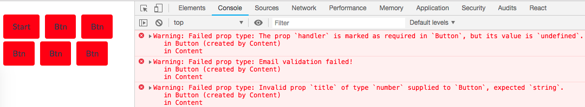
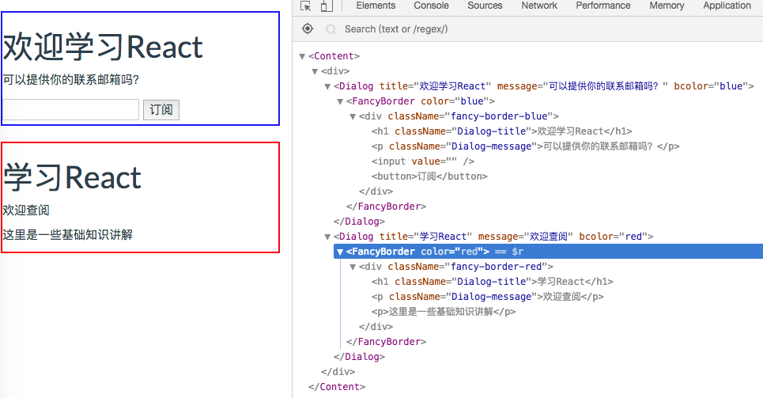
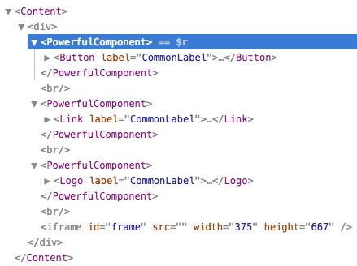

# 表单使用与组建扩展
------
#### 1. 表单使用
* 传统HTML表单元素的状态变化与用户输入同步，但是React是用声明方式来描述UI，输入需要动态反映到state属性中。
* 在React中，表单元素的值在render()中必须包含它的最新值，所以需要通过下面的步骤来实现组件内部状态与视图同步：
    - 在render()中使用来自state的值定义元素
    - 用onChange捕获表单元素的变更
    - 在事件处理函数中更新内部状态
    - 将值保存在state中，然后重新执行render()以更新视图
```javascript
handleChange(event){
    this.setState({title:event.target.value});
}
render(){
    return <input type="text" name="title" value={this.state.title} onChange={this.handleChange.bind(this)} />
}
```

* 上面这种操作成为 *单项绑定* ，只有从状态到视图的单项数据流动。
* 向上面这样的组件成为 *受控组件* 它保持组件内部状态始终与视图同步。
* React中，表单定义从`<form></form>`开始。form可以注册事件，推荐的是`onChange`事件，它监听表单中任何输入变化时都会触发。而在传统DOM的change事件只在失去焦点后才触发，React中的change事件类似于DOM中的onInput。form还有一个`onSubmit`事件，当表单被提交时触发。

##### 1.1 创建受控组件
* 受控组件需要状态来设置value值和监听change事件，在事件处理函数中设置状态值来让UI同步更新。
* 常见表单元素`<input> <textarea> <select> <option>`
* 通过onChange事件，我们可以读取下面的属性：
    - value: 适用于`<input> <textarea> <select>`
    - checked:适用于`<input type="checkbox"> <input type="radio">`
    - selectd:适用于`<option>`
* 下面通过例子介绍各个表单元素的使用方法：

```javascript
class Content extends React.Component {
    constructor(props){
        super(props);
        this.handleChange = this.handleChange.bind(this);
        this.handleInput = this.handleInput.bind(this);
        this.handleSubmit = this.handleSubmit.bind(this);

        this.handleRadio = this.handleRadio.bind(this);
        this.handleCheckbox = this.handleCheckbox.bind(this);
        
        this.handleSelectChange = this.handleSelectChange.bind(this);
        this.handleMultiSelectChange = this.handleMultiSelectChange.bind(this);
        
        this.state = {
            name:"rui",
            password:"123456",
            description : "description is here",
            radioGroup: {angular:false, react:true, vue:false},
            checkboxGroup:{node:false, react:true, express:false, mongodb:false},
            selectedValue: 'node',
            multiselectValue:['A','B']
        }
    }
}
```
上面的constructor构造函数里整齐的绑定了很多事件处理函数，以及初始化this.state={}。下面我们一一创建表单元素的事件处理函数与render的值。

```javascript
//<input> type="text"|"password" <textarea>
handleChange(event) {
    console.log('onChange', event.target.value, event.target.checked);
    this.setState({[event.target.name]:event.target.value});//利用可计算的属性名方式更新响应状态值
}

render(){
    return <div>
        <form onSubmit={this.handleSubmit}>
            <input type="text" name="name" value={this.state.name} onChange={this.handleChange} />
            <input type="password" name="password" value={this.state.password} onChange={this.handleChange} onInput={this.handleInput} />
            <textarea name="description" value={this.state.description} onChange={this.handleChange}/>
        </form>
    </div>
}
//上面三个表单元素都绑定同一个事件处理函数handleChange，通过元素的name值与state里的字段对应，通过event.target.value获取输入的值，将它更新到this.state中对应的属性。

//<select>
handleSelectChange(event){
    console.log('Select',event.target.value);
    this.setState({selectedValue: event.target.value});
}

handleMultiSelectChange(event){//下拉多选的事件处理方式
    console.log('MultiSelect',event.target.value,event.target.selected);

    var options = event.target.options;//需要获取options选项的值
    var value = [];
    for (var i = 0, l = options.length; i < l; i++) {
        if (options[i].selected) {//更新已选的项到新数组value中
            value.push(options[i].value);
        }
    }
    this.setState({multiselectValue: value});//即是更新状态值
}

render(){
    return <div>
        <form>
            <select  value={this.state.selectedValue} onChange={this.handleSelectChange}>
                  <option value="ruby">Ruby</option>
                  <option value="node">Node</option>
                  <option value="python">Python</option>
                </select>
                <hr/>
                <select  multiple={true} value={this.state.multiselectValue} onChange={this.handleMultiSelectChange}>
                  <option value="A">A</option>
                  <option value="B">B</option>
                  <option value="C">C</option>
                </select>
        </form>
    </div>
}

//<input> type="radio" | type="checkbox"
handleRadio(event){//3个radio元素的事件处理函数都是handleRadio
    console.log('Radio',event.target.value, event.target.checked);
    let obj = this.state.radioGroup;
    for(let key in obj){
        if(event.target.value == key){//通过判断value值与state.radioGroup的对应属性复制，由于是单选，所以需要将其他radio赋值成false
            obj[key] = event.target.checked;
        } else {
            obj[key] =  ! event.target.checked;
        }
    }
    this.setState({radioGroup:obj});
}

handleCheckbox(event){
    console.log('Checkbox',event.target.value, event.target.checked);
    let obj = this.state.checkboxGroup;
    obj[event.target.value] = event.target.checked;//多选框只需修改对应的状态值即可。
    this.setState({checkboxGroup: obj});
}

render(){
    return <div>
    <form>
        <input type="radio" name="radioGroup" value='angular' checked={this.state.radioGroup['angular']} onChange={this.handleRadio}/>Angular
        <input type="radio" name="radioGroup" value='react'  checked={this.state.radioGroup['react']} onChange={this.handleRadio}/>React
        <input type="radio" name="radioGroup"  value='vue' checked={this.state.radioGroup['vue']} onChange={this.handleRadio}/>Vue
                
        <input type="checkbox" name="checkboxGroup" value='node' checked={this.state.checkboxGroup['node']} onChange={this.handleCheckbox}/>Node
        <input type="checkbox" name="checkboxGroup" value='react'  checked={this.state.checkboxGroup['react']} onChange={this.handleCheckbox}/>React
        <input type="checkbox" name="checkboxGroup"  value='express' checked={this.state.checkboxGroup['express']} onChange={this.handleCheckbox}/>Express
        <input type="checkbox" name="checkboxGroup" value='mongodb' checked={this.state.checkboxGroup['mongodb']} onChange={this.handleCheckbox}/>MongoDB
        </form>
    </div>
}
```
完整例子代码见：[std5/element](../std/std5/element)

##### 1.2 创建非受控组件
* 使用受控组件是最佳实践，但有时未设置value值（即不是动态值也不是静态值），则此时的表单元素可能不受控制。典型的非受控组件：`<input type="button" onClick={this.handleSubmit}/>`
* 非受控组件可以不使用事件捕获获取值，使用 *引用*方式也可获取值：`<input ref="userEmail" />`
* 由于非控组件没有value值设定初始化值，则可通过`defaultValue=""`来设置初始化值。
* 下面是非受控组件的实现方式：

```javascript
class Content extends React.Component {
    constructor(props) {    
        super(props);
        this.submit = this.submit.bind(this);
        this.prompt = 'Please enter your email to win $1,000,000.';
    }
    submit(event) {
        let emailAddress = this.refs.emailAddress;//通过refs获取对应元素
        let comments = this.refs.comments;//通过refs获取对应元素
        console.log(ReactDOM.findDOMNode(emailAddress).value);//获取元素的值
        console.log(ReactDOM.findDOMNode(comments).value);//获取元素的值
    }
    render() {
        return (
          <div className="well">
            <p>{this.prompt}</p>
            <div className="form-group">
              Email: <input ref="emailAddress" className="form-control" type="text" defaultValue="hi@react"/>
            </div>
            <div className="form-group">
              Comments: <textarea ref="comments" className="form-control"  defaultValue="I like your website!"/>
            </div>
            <div className="form-group">
              <a className="btn btn-primary" onClick={this.submit}>Submit</a>
            </div>
          </div>
        )
    }
}
```
推荐使用受控组件方式创建表单，本例子完整代码见：[std5/uncontrolled](../std/std5/uncontrolled)

#### 2. 扩展组件

##### 2.1 组件默认属性与属性类型提示
* 创建组件的基本方法我们已经掌握，为了更好的开发，我们还可以利用React为我们提供的 *组件默认属性* 和 *属性类型提示* 两个功能来增加代码的容错性和开发环境的友好提示。
* 我们在组件类上添加`defaultProps={}`来设置组件的默认属性，当别人忘记传入必须的属性值时，组件会显示`defaultProps`中的默认值。
* 我们在开发阶段在组件类上添加`propTypes={}`来设置属性值的类型，当类型不匹配时，会在浏览器`Console`中发出提示`Warning`。

```javascript
class Content extends React.Component {
    render(){
        return (
            <div>
                <Button buttonLabel="Start"/>//buttonLabel是必须的属性
                <Button />//忘记传buttonLabel
                <Button />//忘记传buttonLabel
                <Button />//忘记传buttonLabel
            </div>
            )
    }
}
```
下面是Button组件：
```javascript
const Button = props => <button className="btn" >{props.buttonLabel}</button>
Button.defaultValue = {buttonLabel:"Butn"}//设置默认属性值

Button.propTypes = {//设置属性类型提示
    handler:PropTypes.func.isRequired,//handler 是函数类型，且为必须
    title:PropTypes.string,//可选的title属性，类型为字符串
    email(props, propName, componentName) {//使用正则表达式检验email属性的值是否符合相关格式
    let emailRegularExpression = /^([\w-]+(?:\.[\w-]+)*)@((?:[\w-]+\.)*\w[\w-]{0,66})\.([a-z]{2,6}(?:\.[a-z]{2})?)$/i
    if (!emailRegularExpression.test(props[propName])) {
      return new Error('Email validation failed!')
    }
  }
}
```
* 值的注意的是propTypes的类型定义来自独立的包（prop-types），需要单独引用入html中。

执行结果：



##### 2.2 渲染子组件
* 子组件通过`this.props.children`渲染，父组件可以设计成通用的`<div>包装器`，它可以有很多样式，布局，交互事件等等。对于里面的子组件是完全松耦合的，子组件可以各种各样。
* `this.props.children`属性当含多个子组件时，可以通过`React.Children.count(this.props.children)`获取子组件数量，再通过`{this.props.children[0]}`方式访问。


```javascript
const FancyBorder = props => {//抽象组件FancyBorder，根据属性显示不同颜色
    return (<div className={'fancy-border-' + props.color}>{props.children}</div>);
} 

class Dialog extends React.Component { //对话框组件，向FancyBorder添加了一个标题和 一个信息作为子组件，以及从Dialog父组件传递下来的其他子组件
    render(){
        return (
            <FancyBorder color={this.props.bcolor}>
              <h1 className="Dialog-title">
                {this.props.title}
              </h1>
              <p className="Dialog-message">
                {this.props.message}
              </p>
              {this.props.children}
            </FancyBorder>
          );
    }
}

class Content extends React.Component {
  constructor(props) {
    super(props);
    this.handleChange = this.handleChange.bind(this);
    this.handleSignUp = this.handleSignUp.bind(this);
    this.state = {login: ''};
  }

  handleChange(e) {
    this.setState({login: e.target.value});
  }

  handleSignUp() {
    alert(`欢迎订阅 , ${this.state.login}!`);
  }

  render() {
    return (
      <div>
        <Dialog title="欢迎学习React" message="可以提供你的联系邮箱吗？" bcolor="blue">
          <input value={this.state.login} onChange={this.handleChange} />
          <button onClick={this.handleSignUp}>订阅</button>
        </Dialog>
        <Dialog title="学习React" message="欢迎查阅" bcolor="red">
          <p>这里是一些基础知识讲解</p>
        </Dialog>
      </div>
    );
  }
}
```
Content中有两个Dialog组件，它们的子组件分别是不同的元素组成，通过`this.props.children`都可以穿透组件
完整代码见：[std6/children](../std/std6/children)，下面是执行结果：



##### 2.3 高阶组件（Higher-Order Component）
* 高阶组件的定义类似函数，使用另一个组件作为参数，此参数由该组件继承与HOC
* 下面的例子是有3个已存在的展示组件，需要给它们增加公共的属性与事件响应，所以添加一个高阶组件来做这个事。

```javascript
const Button = props => <button className="btn btn-primary" onClick={props.handleClick}>{props.label}</button>;
const Link = props => <a onClick={props.handleClick} href="#">{props.label}</a>;
const Logo = props => 
```

`<Button> <Link> <Logo>`是可以复用的展示组件，封装它们并添加公共的新功能：点击后显示网站到`<frame>`中，并且需要使用公共的label属性值。

```javascript
const Loader = (Component) => {//创建一个高阶组件
    
    class _Load extends React.Component {
        constructor(props) {
            super(props);
            this.state = {
                label: 'CommonLabel', //公共属性label
                handleClick: this.handleClick.bind(this)//公共点击事件处理函数
            } 
        }
        getUrl() {
          return 'http://baidu.com'
        }
        handleClick(event) {
          document.getElementById('frame').src = this.getUrl();//点击后显示网页到iframe中
        }
        componentDidMount() {
          console.log(ReactDOM.findDOMNode(this));
        }
        render() {//渲染传入的Component，并将_Load的状态和属性传递下去
          console.log(this.state);
          return <Component {...this.state} {...this.props} />
        }  
    }

    _Load.displayName = 'PowerfulComponent'

    return _Load; 
}
```
上面的Loader就是一个高阶组件，传入的组件经过改造升级后被返回。通常`_`代表私有，及不能作为公共接口，所以我们给`_Load`取一个可供展示的名字`PowerfulComponent`，这样在浏览器中看到的组件名称就是PowerfulComponent了。

执行代码：



[返回顶端](#表单使用与组建扩展) [返回目录](../README.md) 