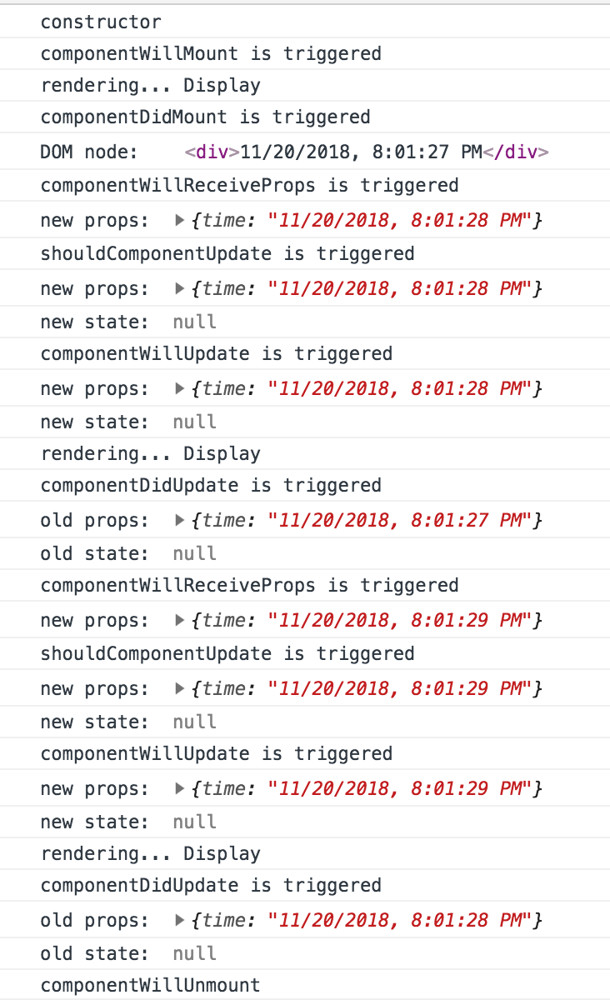

# 组件生命周期
------
使用组件生命周期可以更细颗粒度的控制组件，例如：加载一些服务器端端数据，根据屏幕尺寸改变组件大小等等自包含逻辑。

#### 1. 生命周期事件的分类
* 组件的生命周期事件分为：`挂载`，`更新`，和`卸载`
* `挂载`：只执行一次
* `更新`：执行多次
* `卸载`：只执行一次
* 下图是一个组件的生命周期图：

| 分类 | 生命周期事件 | 描述  | 备注 |
| ----|----|----| ----|
| 挂载 | constructor|发生在创建元素时| 可以添加组件默认属性和初始化状态对象|
|挂载|componentWillMount|发生在挂载到DOM之前|可以在此处调用setState(),render方法会得到最新值，且不会执行额外渲染|
|挂载|componentDidMount|发生在挂载和渲染之后|因为DOM已经挂载好，在此向服务器请求数据或放置一些其他框架和库集成的代码是推荐做法。仅在浏览器端执行，服务器端不会执行，没有DOM加载的概念|
|更新|componentWillReceiveProps(nextProps)|发生在组件即将接收属性时||
|更新|shouldComponentUpdate(nextProps,nextState)|通过判断组件何时需要更新|在此返回return false可以阻止重新渲染，即componentWillUpdate不会被调用|
|更新|componentWillUpdate(nextProps,nextState)|发生在组件将要更新之前|不要在此调用setState()|
|更新|componentDidUpdate(prevProps,prevState)|发生在组件更新完成后||
|更新|render|||
|卸载|componentWillUnmount|发生在组件即将卸载|在这里清除计时器，清理DOM元素，解除事件绑定|

#### 2. 例子：demo1
这个例子主要是将上面的组件生命周期方法全部执行一次，巩固概念。
* `mkdir std3 && cd std3`
* `mkdir demo1`
* `npm init -y`
* `npm install --save-dev babel-cli babel-preset-react`
* 配置`package.json`的babel预设
* 添加`"build-demo1": "./node_modules/.bin/babel demo1/jsx -d demo1/js -w"`

添加HTML文件
```html
<!DOCTYPE html>
<html>
  <head>
    <script src="js/react.js"></script>
    <script src="js/react-dom.js"></script>
  </head>
  <body>
    <div id="content"></div>
    <script src="js/logger.js"></script>
    <script src="js/content.js"></script>
    <script src="js/script.js"></script>
  </body>
</html>
```
添加script.jsx
```javascript
ReactDOM.render(
    <div>
        <Content />
    </div>,
    document.getElementById('content')
)
```
添加content.jsx
```javascript
class Content extends React.Component {
    constructor(props){
        super(props);
        this.launchClock()
        this.state = {
            counter:0,
            currentTime: (new Date()).toLocaleString()
        };
    }
    launchClock(){
        setInterval(()=>{
            this.setState({
                counter:++this.state.counter,
                currentTime: (new Date()).toLocaleString()
            });
        },1000);
    }
    render(){
        if (this.state.counter > 2) {//当counter大于2后，将<Logger>去除，会导致调用<Logger>的componentWillUnmount
            return <div />
        } else {
            return <Logger time={this.state.currentTime} />
        }
    }
}
```
添加logger.jsx
```javascript
class Logger extends React.Component {
    constructor(props) {
        super(props);
        console.log('constructor');
    }
    componentWillMount() {
        console.log('componentWillMount is triggered');
    }
    componentDidMount(e) {
        console.log('componentDidMount is triggered');
        console.log('DOM node: ', ReactDOM.findDOMNode(this));
    }
    componentWillReceiveProps(newProps) {
        console.log('componentWillReceiveProps is triggered');
        console.log('new props: ', newProps);
    }
    shouldComponentUpdate(newProps, newState) {
        console.log('shouldComponentUpdate is triggered');
        console.log('new props: ', newProps);
        console.log('new state: ', newState);
        return true;
    }
    componentWillUpdate(newProps, newState) {
        console.log('componentWillUpdate is triggered');
        console.log('new props: ', newProps);
        console.log('new state: ', newState);
    }
    componentDidUpdate(oldProps, oldState) {
        console.log('componentDidUpdate is triggered');
        console.log('old props: ', oldProps);
        console.log('old state: ', oldState);
    }
    componentWillUnmount() {
        console.log('componentWillUnmount');
    }
    render() {
        console.log('rendering... Display');
        return (
          <div>{this.props.time}</div>
        )
    }
}
```
执行`npm run build-demo1`:转换jsx为js
执行`http-server`运行`localhost:8080`


