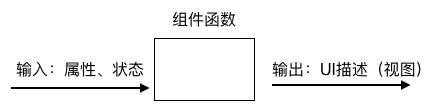
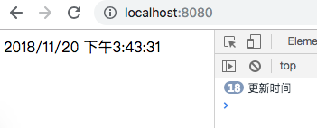
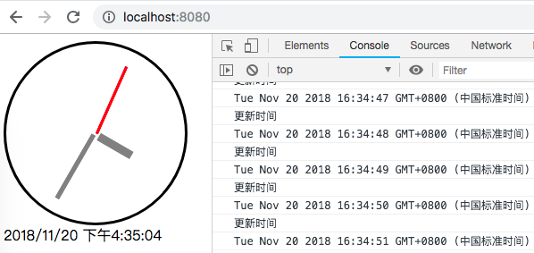
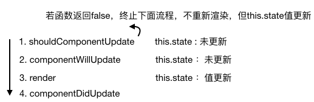

# 组件状态
------
React中组件的状态是非常重要的核心概念，通过状态可以创建出可以存储数据的组件，并根据数据变更自动更新视图。由于组件的属性是在创建时就定义好的且在组件内是不可变的，所以想要在数据变化时更新UI，则需要通过组件状态这一可变的数据存储方式。



#### 1. 使用状态

* 访问状态值通过`this.state.NAME`访问
* 状态是用了存储可变数据的，必须进行状态对象的初始化：`this.state={...}`
* 更新状态必须使用`this.setState({},callback)`方法，第一个参数是需要更新的状态数据对象，里面的属性会覆盖旧的属性值，只会改变传给它的属性，没传的属性不会改变。
* 状态是可变的，它定义在每个组件内部

#### 2. 显示时间例子
* 显示时间每秒更新一次当前时间，通过this.setState()
* 新建一个std2 文件夹，将[std1](../std/std1)中的js(删除script1和script1)和package.json拷贝到std2中，再新建一个jsx文件夹以及clock.jsx和script.jsx
* 修改`package.json`中的`"build": "./node_modules/.bin/babel jsx -d js -w"` 因为有多个jsx文件需要转译为js，所以使用`jsx -d js`命令将jsx文件夹下所有jsx文件转为js后输出到js文件夹下
* 下面修改index.html
```html
<!DOCTYPE html>
<html>
<head>
    <script src="js/react.js"></script>
    <script src="js/react-dom.js"></script>
    <title>std2</title>
</head>
<body>
    <div id="content"></div>
    <script src="js/clock.js"></script>
    <script src="js/script.js"></script>
</body>
</html>
```
先写script.jsx
```javascript
//script.jsx
ReactDOM.render(
    <Clock />,//渲染一个Clock组件
    document.getElementById('content')
    );
```
再创建clock.jsx 的`<Clock />`组件
```javascript
//clock.jsx
class Clock extends React.Component {
    constructor(props){//在构造函数中初始化状态值
        super(props);//执行父类构造函数

        this.state = {//初始化状态对象，创建一个currentTime，值为当前时间
            currentTime : new Date()
        };

        this.launchClock();//调用launchClock来更新时间
    }

    launchClock(){
        setInterval(() => {//箭头函数让this.setState的this指向Clock，而非Window
            
            console.log("更新时间");

            this.setState({//this.setState来改变currentTime值
                currentTime : new Date()
            });
        },1000);
    }

    render(){//渲染一个<div>显示当前时间字符串
        return <div>{this.state.currentTime.toLocaleString()}</div> 
    }
}
```
* 执行`npm run build`后，在std2中执行`http-server`，启动本地服务器，在浏览器中打开`localhost:8080`查看运行结果：时间会每一秒更新



#### 3. 无状态组件与有状态组件
* `无状态组件`是指没有状态或任何React生命周期事件/方法的组件。它存在的目的仅仅是渲染视图。
* 无状态组件可以使用`函数`代替组件类来创建，非常简单，输入属性参数，返回UI元素即可。
* 例：`const Link = props => <h1>{this.props.title}</h1>`
* 请保持无状态组件的简洁性：没有状态，没有方法

我们在std2项目中添加2个 *无状态组件* 用于输出一个纯粹的时钟UI
新建一个clock-display.jsx用于显示时钟，新建一个digital-display.jsx用于显示数字时间。

- 修改clock.jsx 的`<Clock />`组件

```javascript
render(){
        return <div>
            <ClockDisplay time={this.state.currentTime}/>//显示时钟图像
            <DigitalDisplay time={this.state.currentTime}/>//显示数字时间
        </div>
    }
```

- 编写digital-display.jsx

```javascript
const DigitalDisplay = props => <div>{props.time.toLocaleString()}</div>
```

- 编写clock-display.jsx

```javascript
const ClockDisplay = props => {
  let date = new Date(props.time);
 
  let dialStyle = {position: 'relative',top: 0,left: 0,width: 200,height: 200,borderRadius: 20000,borderStyle: 'solid',borderColor: 'black'};
  let secondHandStyle = {position: 'relative',top: 100,left: 100,border: '1px solid red',width: '40%',height: 1,transform: 'rotate(' + ((date.getSeconds()/60)*360 - 90 ).toString() + 'deg)',transformOrigin: '0% 0%',backgroundColor: 'red'};
  let minuteHandStyle = {position: 'relative',top: 100,left: 100,border: '1px solid grey',width: '40%',height: 3,transform: 'rotate(' + ((date.getMinutes()/60)*360 - 90 ).toString() + 'deg)',transformOrigin: '0% 0%',backgroundColor: 'grey'};
  let hourHandStyle = {position: 'relative',top: 92,left: 106,border: '1px solid grey',width: '20%',height: 7,transform: 'rotate(' + ((date.getHours()/12)*360 - 90 ).toString() + 'deg)',transformOrigin: '0% 0%',backgroundColor: 'grey'}
  
  return <div>
    <div style={dialStyle}>//时钟的外圈
      <div style={secondHandStyle}/>//时钟的秒针
      <div style={minuteHandStyle}/>//时钟的分针
      <div style={hourHandStyle}/>//时钟的时针
    </div>
  </div>
}
```
`<ClockDisplay />`与`<DigitalDisplay />`都是无状态的组件，纯粹显示UI。




#### 4. this.setState()

>有人问我：this.setState()是同步还是异步？

* 我们发现`this.setState()`的第二个参数是callback，难道它“异步”的，为什么呢？
* 异步的原因并不是setState方法里有`setTimeout`或返回`Promise`等异步执行，而是因为`setState函数不仅要更新状态值，还需要负责触发re-render，重新渲染里面有React核心的diff算法，最终才能决定是否进行re-render，在连续调用setState函数还会进行合并操作，减少re-render次数`。
* 所以记住：

>setState不会立刻改变React组件中state的值；

>setState通过引发一次组件的更新过程来引发重新绘制；

>多次setState函数调用产生的效果会合并。

* 官方推荐的在setState()后获取准确新状态的方式是：在[组件生命周期](./Lifecycle.md)里处理：

```javascript
componentDidUpdate(){
  console.log(this.state.value)
}
```
因为调用一次setState()会触发组件生命周期的若干函数，见下图：



* 当应用复杂后，我们可以使用[Redux](../part2/Redux.md)或MobX框架来剥离React的State，让其受控。

[返回顶端](#组件状态) [返回目录](../README.md) 