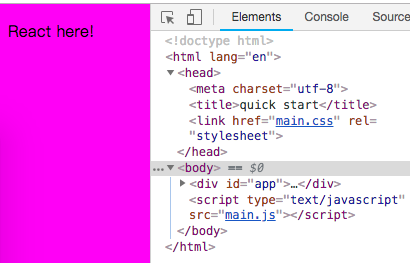
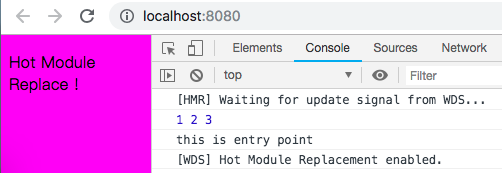
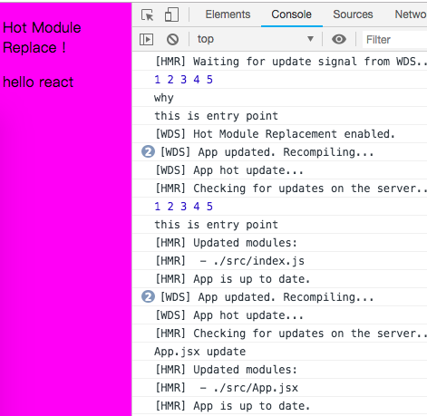

# 项目练习
------

第二部分的基础知识通过前面几个小节就基本介绍完毕了，当然在具体项目实践中还会进行更多概念的知识的学习。运用前面的知识，我们已经可以快速上手React项目了。

本小节我们通过完成一个“热门景区评分”小项目来复习之前所学的。

* 项目代码：[热门景区评分](../std/std13)
* 因为是复习，所以自己搭建项目框架，不用脚手架。

首先思考一下我们需要哪些环境？

1. React(^16.6.3)
2. Webpack(^4.26.1)
3. babel(^7.2.0)
4. devServer(^3.1.10)

part2中的[Webpack](./Webpack.md) 是参考较早的资料总结的，为了项目正常运行，安装的版本都比较陈旧，但发展都是日新月异的，及时关注和更新依赖的库是必要的。所以我们这里都以最新的版本（以我安装的日期为准），来更新配置。

##### 1. 安装webpack 4.x
创建项目文件夹并进入文件夹

`mkdir std13 && cd $_`

在文件夹下创建一个src文件夹用于存放源代码

`mkdir src`

初始化npm生成package.json

`npm init -y`

安装webpack到本地

`npm install --save-dev webpack`

安装webpack-cli到本地(webpack-cli作为一个单独的包存在，所以需要安装)

`npm install --save-dev webpack-cli`

webpack默认入口是： `./src/index.js` 所以在没有`webpack.config.js` 情况下，创建入口文件:

```javascript
//./src/index.js
console.log("this is entry point");
```

在`package.json`中添加script：

```javascript
"scripts": {
    "dev": "webpack --mode development",
    "build": "webpack --mode production"
  }
```

运行 `npm run dev` 与 `npm run build` 看看：

在文件夹下出现了`./dist/main.js`, 它是webpack默认的出口，打好包的文件会在dist下。

`"dev": "webpack --mode development"` 通过cli的方式指定了webpack的模式是development

`"build": "webpack --mode production"` 通过cli的方式指定了webpack的模式是production，生产环境下的main.js 会自动压缩


##### 2. 安装Babel 7.x

因为使用ES6语法，但浏览器厂商支持程度不一，所以需要用Babel进行转换。

babel-loader 需要下面的依赖包：

. babel core

. babel loader

. babel preset env

`npm install --save-dev @babel/core babel-loader @babel/preset-env`

新建一个.babelrc 文件用于配置Babel

`touch .babelrc`

`vim .babelrc` i

写入如下配置：
```javascript
{
    "presets":[
        "@babel/preset-env"
    ]
}
```

esc `:wq`

为了在webpack中使用babel，我们要创建webpack.config.js来配置。

```javascript
//webpack.config.js
module.exports = {
    module: {
        rules: [
            {
                test: /\.js$/,
                exclude: /node_modules/,
                use: {
                  loader: "babel-loader"
                }
            }
        ]
    }
};
```
webpack自身只处理JavaScript，通过loader，让它可以处理其他类型的文件，并将它们转化为模块供应用程序使用。即通过`import`来引入。

每个loader写在module.rules下，必须的属性是`test`和`use`。`test`配置需要被loader转换的文件，`use`配置转换时使用哪些loader。

配置好Babel后，我们在./src/index.js中可以写ES6语法：

```javascript
const arr = [1, 2, 3];
const iAmES6 = () => console.log(...arr);
iAmES6();
```

`npm run dev` 运行后，可以查看main.js代码。


##### 3. 安装React 16.x

安装React 和 ReactDOM

`npm install --save-dev react react-dom`

安装babel-preset-react

`npm install --save-dev @babel/preset-react`

在.babelrc中添加：

```javascript
{
    "presets":[
        "@babel/preset-env",
        "@babel/preset-react"
    ]
}
```

由于习惯将ReactComponent后缀命名为jsx，所以在webpack.config.js中添加对jsx的支持

```javascript
//webpack.config.js
module.exports = {
    module: {
        rules: [
            {
                test: /\.(js|jsx)$/,
                exclude: /node_modules/,
                use: {
                  loader: "babel-loader"
                }
            }
        ]
    }
};
```

新建一个App.jsx 放在./src/

```javascript
import React from "react";
import ReactDOM from "react-dom";

const App = () => {
    return (
        <div>
            <p>React here!</p>
        </div>
    );
};

export default App;

ReactDOM.render(<App />, document.getElementById("app"));
```

在./src/index.js 添加App组件

```javascript
import App from "./App.jsx";

const arr = [1, 2, 3];
const iAmES6 = () => console.log(...arr);
iAmES6();

console.log("this is entry point");
```

运行`npm run dev`，到目前为止，我们还没有看到效果，回忆之前的章节，我们通过创建一个index.html，再将编译后的main.js通过`<script src="main.js"></script>`手动添加到index.html中，webpack可以帮我们自动完成。


##### 4. 添加Html Webpack Plugin

Plugin 是webpack另一个很重要的概念，通过loader，我们可以处理转译，通过添加插件，可以让webpack执行更多的任务，例如上面提到的在index.html中引入所有bundle文件。

安装html-loader 和 html-webpack-plugin插件

`npm install --save-dev html-webpack-plugin html-loader`

在webpack.config.js添加配置
```javascript
const HtmlWebPackPlugin = require("html-webpack-plugin");//引入插件

module.exports = {
    module: {
        rules: [
            ...
            {
                test: /\.html$/,
                use: [{loader: "html-loader", options: { minimize: true }}]
            }
        ]
    },
    plugins: [
        new HtmlWebPackPlugin({
            template: "./src/index.html",
            filename: "./index.html"
        })
    ]
};
```

创建./src/index.html
```html
<!DOCTYPE html>
<html lang="en">
<head>
    <meta charset="utf-8">
    <title>quick start</title>
</head>
<body>
    <div id="app"></div>
</body>
</html>
```

`npm run dev`

把./dist/index.html 放到浏览器中，可以看到页面呈现出React here!字样。

##### 5. extracting CSS to a file

安装css-loader 和 mini-css-extract-plugin插件[https://github.com/webpack-contrib/mini-css-extract-plugin]。

`npm install --save-dev mini-css-extract-plugin css-loader`

创建./src/main.css

```css
/*main.css*/
body{
    background-color: #ff00ff;
}
```

在./src/index.js 中引入main.css

`import style from "./main.css";`

webpack.config.js 配置css
```javascript
const MiniCssExtractPlugin = require("mini-css-extract-plugin");//引入插件

module.exports = {
    module: {
        rules: [
            ...
            {
                test: /\.css$/,
                use: [MiniCssExtractPlugin.loader, "css-loader"]
            }
        ]
    },
    plugins: [
        new MiniCssExtractPlugin({
            filename: "[name].css",
            chunkFilename: "[id].css"
        })
    ]
};
```

`npm run dev` 

可以看到dist下的main.css生成。

注意：extract-text-webpack-plugin 在 webpack 4.x 下无效，用 mini-css-extract-plugin 代替。

##### 6. the webpack dev server

之前的章节中我们讲过为什么要使用本地开发服务器，也安装过`http-server`。webpack-dev-server是配合webpack使用的本地开发服务器，它可以实现自动更新页面和开启热更新（不用刷新页面，模块热替换，配合webpack内置的HMR插件）。

安装webpack-dev-server

`npm install --save-dev webpack-dev-server`

在package.json中添加：

`"start": "webpack-dev-server --mode development --open"`

`npm run start` 即浏览器自动打开加载http://localhost:8080/



###### 开启热更新[HMR] 

在webpack.config.js中引入webpack内置插件HotModuleReplacementPlugin，在devServer.hot = true

```javascript
const webpack = require('webpack');

module.exports = {
    devServer: {
        hot: true
    },
    ...
    plugins: [
        ...
        new webpack.HotModuleReplacementPlugin()
    ]
};
```
在./src/index.js中：
```javascript
if(module.hot){
    module.hot.accept();//全部模块都接受热更新

    module.hot.accept('./App.jsx',function(){//指定单个模块接受热更新
        console.log("App.jsx update");
    });
}
```

`npm run start`






##### 7. 调整项目结构及添加剩余配置

###### 1. 安装clean-webpack-plugin

`npm install --save-dev clean-webpack-plugin`

配置：
```javascript
const CleanWebpackPlugin = require("clean-webpack-plugin");

module.exports = {
    ...
    plugins: [
        new CleanWebpackPlugin(["dist"]),
        ...
    ]
};
```

用于每次编译时先删除dist目录，再重新生成，以免造成“废文件”存在。

###### 2. 安装 eslint

在[Jest&ESLint](./Jest.md) 小节中我们单独安装了eslint，现在要将它添加到webpack环境，需要依次安装下面的依赖包：

`npm install --save-dev eslint eslint-plugin-react eslint-loader`

在webpack.config.js中配置：

```javascript
{
    test: /\.(js|jsx)$/,
    exclude: /node_modules/,
    use: ["babel-loader", "eslint-loader"]
}
```

初始化eslint，生成.eslintrc.js文件

`./node_modules/.bin/eslint --init`

回答若干问题后生成.eslintrc.js

安装babel-eslint 来检查ES6代码

`npm install --save-dev babel-eslint`

在.eslintrc.js 中配置：

```javascript
"parser": "babel-eslint",
```

`npm run dev` 查看代码有无规范问题。


