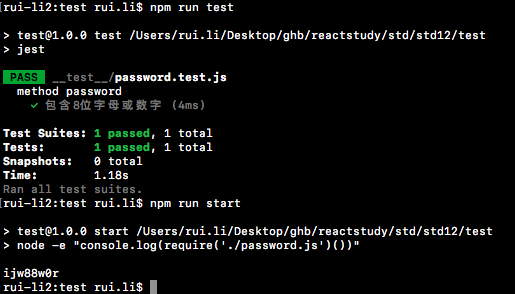

# Jest
------

>Code isn't an asset, it's a liability

* 代码不是资产，是负债。（使用代码构建的应用/产品/服务是资产，但代码不是，资产可以产生收入，代码本身不产生任何收入，它是产出资产的工具）
* 代码需要维护，为了使维护成本降低，要尽可能使代码简单，稳健，灵活。
* 使用测试（TDD/BDD)可以使维护更容易。
* 测试一般有3类：*单元测试* *服务（集成）测试* *UI测试*
    - *单元测试* ：测试独立的方法和类，以验证被测试方法的工作原理。
    - *服务（集成）测试* ：设计依赖关系，需要单独环境。
    - *UI测试* ： 通常模拟用户操作，涉及整个系统。
    
#### 1. 使用Jest进行单元测试
* Jest是Facebook开发的测试工具，经常与React一起使用。
* 我们按照下面的步骤来进行一次单元测试
    
1.新建一个文件夹`test`，安装Jest:`npm install --save-dev --save-exact jest-cli@19.0.2` 

2.创建一个`__test__`文件夹，Jest会从该文件夹提取测试，在此文件夹中创建一个`password.test.js`的文件。

3.在根目录下创建一个`password.js`，这个模块有一个方法：随机生产一个8位字符串：
    
```javascript
    function password(){
        return Math.random().toString(36).slice(-8);
    }

    module.exports = password;
```
4.在`password.test.js`中进行测试

```javascript
describe('method password', ()=>{//describe是测试包装器，测试用例嵌套在其中
  let password;
  let generatePassword = require('../password');//导入password模块

  it('包含8位字母或数字', (done)=>{//it是一个测试用例
    password = generatePassword();
    expect(password).toMatch(/^[a-z0-9]{8}$/);//expect断言password的结果要符合8位由字母或数字包含
    done();//测试完毕
  })
})
```

5.在`package.json`中添加script：`"test": "jest"`，运行`npm run test`，可以看到结果打印出来，如下图：



上述步骤就完成了一个非常单纯的单元测试。

