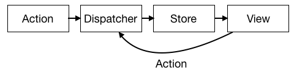

# Redux
------

#### 1. React的State管理
* 在第一部分的[组件状态](./part1/State.md)小节中，我们知道React通过State来管理和更新数据。
* 通常推荐的做法是在组件的根结点的某个位置来存放应用的state，这样做的好处是将应用程序的数据管理在统一的位置，通过让数据在组件树中向上或向下传递来让子组件调用。
* 然而随着应用程序规模的不断扩大，这样的管理方式会增加程序的复杂性，此时将State独立出来与自身的层级隔离，是最佳实践。
* 简单而言就是不在应用内使用React的State/setState()方法。

#### 2. 在React之外管理State
* 在React之外管理State会减少大量类组件的使用，可以使用很多无状态组件让应用更加明确化和易于复用、测试。
* Facebook因此推出了一种设计模式：Flux ——》 旨在保持数据的单向流动。
* Flux架构：把State数据存放在Store中，Store保留和更改数据，从而更新视图



* Redux: 一个基于类Flux的框架，它使用单个不可变对象表示应用程序的state，引入Reducer。

#### 3. Redux核心概念
* `Action`
* `Reducer`
* `Store`
* `Action生成器`
* `中间件`

##### 3.1 Action
Action是Redux更新数据的唯一方式，因为应用程序的State是存放在单个不可变对象中的，需要Action来告知变更指令和这些变更需要的数据。一个Action就是一个JavaScript对象，它至少包含一个`type`字段，表明Action的类型。

```javascript
//ADD_COLOR Action
{
    type: "ADD_COLOR",
    title:"Big Black"
    color: "#000000",
    id: "003",
    rating:0
}
```
这个Action告诉Redux添加一个id为003的新颜色到state中。所以看出，Action就是小而美的数据包，能够方便告知如何修改State。

##### 3.2 Reducer
Redux通过Reducer来模块化描述对象，通过传入当前State和Action作为Reducer的参数，返回一个新的State。

```javascript
//假设应用程序的State树为下面表述：
{
    colors:[
        {
            title: "Ocean Blue",
            color: "#0070ff",
            id: "001",
            rating:0
        },
        {
            title: "Apple Red",
            color: "#FF3300",
            id: "002",
            rating:2
        }
    ],
    sort:"SORTED_BY_DATE"
}
```
我们通过Reducer来聚焦State树的特定部分，对应State树，Reducer树可以由多个Reducer合成，用来更新整个State树和处理任意的Action。下面是应用程序的所有Reducer
```javascript
const color = (state={},action) => { return {}}
const colors = (state=[],action) => {return []}
const sort = (state="SORTED_BY_DATE",action) => {return ""}
```
记住：Reducer是纯函数，接收State作为第一个参数，Action作为第二个参数，Reducer不会产生副作用，并应将参数作为不可变数据。

Reducer的实现方式有很多，常见的选择是使用switch语句，因为Reducer必须处理多种Action：

```javascript
const color = (state={}, action) => {
    switch (action.type){
        case "ADD_COLOR":
            return {
                id:action.id,
                title:action.title,
                color:action.color,
                rating:0
            }
        case "RATE_COLOR":
            return (action.id !== state.id) ? state : {...state,rating:action.rating}
        default:
            return state
    }
}

//某个Action
let action = {
    type: "ADD_COLOR",
    title:"Big Black"
    color: "#000000",
    id: "003",
    rating:0
}

color({},action);
```

color Reducer 可以处理两种类型的Action，添加一个color 和 给某个color打分。

##### 3.3 Store
Redux的Store是保持State数据和处理State更新的地方，Flux框架中，Store是可以多个共存的，每个Store只专注于特定的数据集，而Redux中Store是唯一的，只有一个。Store有很多常见的方法，来处理State。

* 获取应用程序的State: `store.getState()`
* 创建store： `const store = createStore(Reducers, initStateData)`
* 合并多个Reducer： `combineReducers({ colors, sort })`
* 分发Action： `store.dispatch(Action)`
* 监听/订阅 store： `store.subscribe(callback)` 每次分发完一个Action就会触发一次
* 取消监听/订阅 store： `store.subscribe(callback)()`

总之，Store是Redux应用程序中保存和管理State数据的地方，也是通过store分发Action的形式来改变State数据。

```javascript
//自定义combineReducers()
const combinedReducers (reducers) => {
    return (state={},action) => {
        return Object.keys(reducers).reduce((nextState,key) => {
            nextState[key] = reducers[key](state[key],action);
            return nextState;
        },{});
    };
};
```

##### 3.4 Action生成器
Action对象是通过简单小而美的js语法表示的，Action生成器就是返回这类语法格式的函数。可以为每一种Action类型添加一个对应的生成器：
```javascript
const addColor = (title,color) => ({
    type: "ADD_COLOR",
    id:"xxx",
    title,
    color,
    rating:0
})

const rateColor = (id,rating) => ({
    type: "RATE_COLOR",
    id,
    rating
})

store.dispatch(addColor("Little Pink","#F142FF"));
```

我们应该将所有和后端API交互的逻辑内容放到Action生成器中。

##### 3.5 中间件
中间件可以扮演store分发管道的角色。

#### 4. React-Redux
* Redux是在React之外处理State数据的解决方案，我们还需要将它与UI界面连接在一起，通俗讲就是怎样让React组件获取Store，我们有多种方式：
    - 通过组件属性显示传递Store
    - 通过context上下文传递Store
    - 通过 `react-redux`框架传递Store
    
* 表现层组件就是那些渲染UI元素的组件，它们没有和数据架构紧密的耦合在一起，这种架构的优点之一是表现层组件可复用，这样的组件容易替换，也方便测试。
* 容器组件：将表现层组件和数据连接在一起的组件。
* react-redux提供了`Provider` 它将Store添加到上下文对象中，`Connect()`函数创建出容器组件。

```javascript
import { Provider } from 'react-redux';

render(
    <Provider store={store}>
    <APP />
    </Provider>,
  document.getElementById('root')
)
```

```javascript
import { connect } from 'react-redux'
​
const VisibleTodoList = connect(
  mapStateToProps,
  mapDispatchToProps
)(TodoList)
​
export default VisibleTodoList
```

#### 5. 例子demo


[返回顶端](#Redux) [返回目录](../README.md)
