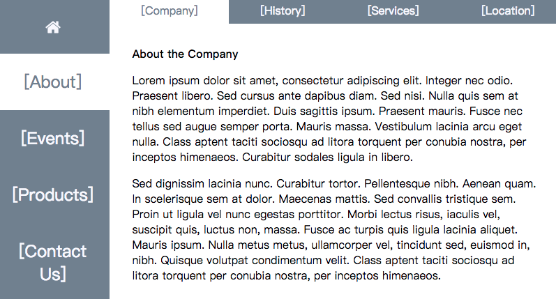

# 路由
------
#### 1. 路由的概念

* 对于后端来说，*路由* 就是指确定应用程序如何响应客户端请求，当我们访问某个URL时，客户端会向服务器发出请求，例如：`https://xxx/secnic` 服务器会响应并经过逻辑处理后返回一个结果给客户端(可以是页面或者数据)。
* 路由分发就是为客户端请求定义端点的过程。
* 早期的网站都是由用户通过请求并打开若干独立的文件的一系列页面构成，当前文件或资源的位置会显示在浏览器地址栏，浏览器导航和历史回退功能都可以正常工作。
* 在SPA中，由于所有内容都是在一个页面呈现的，所以在没有 *路由分发*解决方案情况下，浏览器无法正常使用导航、历史记录等。
* 前端的路由分发解决方案常见的有：
    - 利用定义锚点连接的hash（#）字符，当在地址中使用（#）时，浏览器不会向服务器发送请求，通过window.location.hash可以读取哈希值，所以这类地址都带有：`https://xxx/#/secnic`
    - 利用浏览器的history API，可以操作前进后退等功能。
    

#### 2. 手动创建路由
我们看一个例子：
```javascript
const mapping = {
    '#profile' : <div>个人信息（<a href="#">返回主页</a>）</div>,
    '#account' : <div>账户信息（<a href="#">返回主页</a>）</div>,
    '*' : <div><p>目录</p><ul><li><a href="#profile">个人信息</a></li><li><a href="#account">账户信息</a></li></ul></div>
};

ReactDOM.render(
  <Router mapping = {mapping} />,
  document.getElementById('content')
)
```

我的应用程序根目录渲染了一个<Router>组件，传递了一个mapping属性，它映射着不同路由对应的显示内容。

```javascript
class Router extends React.Component {
    constructor(props){
        super(props);
        this.state = {
            hash: window.location.hash
        }
        this.updateHash = this.updateHash.bind(this);
    }

    updateHash(event){
        console.log(window.location.hash);
        this.setState({
            hash: window.location.hash
        });
    }

    componentDidMount(){
        window.addEventListener('hashchange',this.updateHash,false);
    }

    componentWillUnmont(){
        window.removeEventListener('hashchange', this.updateHash, false);
    }

    render() {
        if (this.props.mapping[this.state.hash]){
            return this.props.mapping[this.state.hash]
        }
        else{
            return this.props.mapping['*']
        }
    }
}
```
Router组件通过在生命周期中监听hashchange事件，当地址栏的哈希改变时，触发处理函数，我们获取到当前的hash值，将它放入state中，并在render函数中判定渲染内容。

完整例子见：[std9/simple-router](../std/std9/simple-router)

#### 3. 使用路由库React Router

* React Router 是社区广泛使用的路由库，因为React自身没有附带一个标准的router，Angular自身带有路由库。
* `react-router-dom` 提供了2种选择来管理SPA应用中的导航历史记录。
    - `HashRouter`：专客户端设计的，对于不需要后端服务的小型客户端网站是非常好的工具
    - `BrowserRouter`：需要向后端请求的，URL中没有 *#*号。
* 一些基础的API：
    - `<HashRouter>` ：一个<Router>，它使用URL的哈希部分（即window.location.hash）来保持UI与URL同步。它作为应用程序的根组件渲染，每个路径可以在HashRouter中使用Route组件进行定义。
    - `<Route path="" component={}/>`：每个Route组件都包含`path`和`component`属性。浏览器地址与path匹配时，component组件就会被渲染显示。例如：`<Route exact path="/" component={Home} />` 访问路径`/`时，Home 组件被渲染。exact表示精确匹配。
    - `<Link to="/about">`：连接，React版本的`<a href="">`
    - `<NavLink to="" activeStyle={}>`：<Link>的特殊版本，它将在与当前URL匹配时为渲染元素添加样式属性
    - `<Switch>`：只会显示首个匹配的路由，可以将`404`路由放到Switch的最后一个，当都不匹配时，则渲染404路由
    - `<Redirect from="" to="">`：重定向
    - `withRouter()`：是一个HOC，通过将组件传递给它，返回的组件则被添加了导航功能
    - `<BrowserRouter>`：使用HTML5历史记录API（pushState，replaceState和popstate事件）的<Router>，以使UI与URL保持同步。
    
* 一个例子：***(来自：React学习手册--Alex Banks & Eve Porcello著）***

```javascript
render(
  <HashRouter>
    <div className="main">
      <Switch>
        <Route exact path="/" component={Home} />
        <Route path="/about" component={About} />
        <Redirect from="/history" to="/about/history" />
        <Redirect from="/services" to="/about/services" />
        <Redirect from="/location" to="/about/location" />
        <Route path="/events" component={Events} />
        <Route path="/products" component={Products} />
        <Route path="/contact" component={Contact} />
        <Route component={Whoops404} />
      </Switch>
    </div>
  </HashRouter>,
  document.getElementById('react-container')
)
```

在应用程序根组件渲染`<HashRouter>`，将并列的`<Route>`添加到`<Switch>`下，其中最后一个路由是转发到404页面，第一个路由是精准匹配到Home页面。另外还有4的路由，分别转发到about、events、products和contact页面。另外还有3个重定向。上述路由组成了应用最外层框架。

```javascript
export const Home = () =>
    <div className="home">
        <h1>[Company Website]</h1>
        <nav>
            <Link to="about">[About]</Link>
            <Link to="events">[Events]</Link>
            <Link to="products">[Products]</Link>
            <Link to="contact">[Contact Us]</Link>
        </nav>
    </div>
```

在Home页面，我们有4个<Link>链接，点击它们可以导航到对应的页面。下面是对应的页面组件

*  404组件

```javascript
//404 页面
export const Whoops404 = ({ location }) =>
    <div className="whoops-404">
        <h1>Resource not found at '{location.pathname}'</h1>
    </div>
```

`<Route>`组件有3个属性传递给它渲染的组件，分别是`match`， `location`， `history` 。所以组件Whoops404可以访问Route 的属性location。location是一个对象，它表示应用程序的位置，有下面的基本属性可以访问：

```javascript
{
  key: 'ac3df4', // not with HashHistory!
  pathname: '/somewhere'
  search: '?some=search-string',
  hash: '#howdy',
  state: {
    [userDefined]: true
  }
}
```

* 可复用的组件

例子中有些页面含有相同的部分，例如左列的主菜单，在导航时，我们希望这些菜单保持不变，传统做法有页面模版和母页面来复用UI元素，在React中，我们用孩子属性合成模版。

```javascript
//PageTemplate
const PageTemplate = ({children}) =>
    <div className="page">
        <MainMenu />
        {children}
    </div>

//MainMenu组件
export const MainMenu = () =>
    <nav className="main-menu">
        <NavLink to="/"><HomeIcon/></NavLink>
        <NavLink to="/about" activeStyle={selectedStyle}>[About]</NavLink>
        <NavLink to="/events" activeStyle={selectedStyle}>[Events]</NavLink>
        <NavLink to="/products" activeStyle={selectedStyle}>[Products]</NavLink>
        <NavLink to="/contact" activeStyle={selectedStyle}>[Contact Us]</NavLink>
    </nav>
```

页面模版由一个MainMenu和其他子组件构成。主菜单使用了NavLink，它是特殊的Link组件，可以设置activeStyle属性来改变选中状态的css样式。

* 子页面和子菜单

我们已经有了公共页面模版，接下来创建子页面和子菜单
```javascript
export const Events = () =>
    <PageTemplate>
      <section className="events">
          <h1>[Event Calendar]</h1>
      </section>
    </PageTemplate>

export const Products = () =>
    <PageTemplate>
        <section className="products">
            <h1>[Product Catalog]</h1>
        </section>
    </PageTemplate>

export const Contact = () =>
    <PageTemplate>
        <section className="contact">
            <h1>[Contact Us]</h1>
        </section>
    </PageTemplate>

export const About = ({ match }) =>
    <PageTemplate>
        <section className="about">
            <Route component={AboutMenu} />
            <Route exact path="/about" component={Company}/>
            <Route path="/about/history" component={History}/>
            <Route path="/about/services" component={Services}/>
            <Route path="/about/location" component={Location}/>
        </section>
    </PageTemplate>
```

about、events、products和contact页面都使用了<PageTemplate>模版，我们再在about页面添加一个子菜单，点击子菜单的about、history、services和location，又转发显示对应的组件。每个about的子页面都带有AboutMenu组件，所以我们的第一个<Route component={AboutMenu} /> 没有带path路径，它会一直显示AboutMenu。

完整代码参加：[std11/react-router-demo](../std/std11/react-router-demo) 

运行后的结果：



*  `<Route>`的`match`属性和`history`属性
    - match属性是一个对象，它包含有关<Route path>如何与URL匹配的信息。 match对象包含以下属性：
        - params ： 从URL解析出来的参数，`<Route path="/about/:id/:city" component={About}` ，id值和city值都通过`this.props.match.params.id` 和 `this.props.match.params.city` 获取，如果是About组件获取，则可以`const About = ({match}) => {<h1>{match.params.id} {match.params.city}</h1>}`
        - isExact ：如果匹配整个URL，则为true
        - path ： 用于匹配的路径模式。 用于构建嵌套的<Route>s
        - url ：URL的匹配部分。 用于构建嵌套的<Link>s
    - history属性也是一个对象，它含有下列常用方法和属性：
        - push(path, [state])：将新条目推送到历史堆栈
        - replace(path, [state])：替换历史堆栈上的当前条目
        - goBack()：将历史堆栈中的指针向后退1
        - goForward()：将历史堆栈中的指针向前进1


#### 4. React Router 原理

##### 4.1 js中的window.history

* H5的History API 提供一系列操作浏览器历史记录的方法，可以实现无刷新更改地址栏链接，结合AJAX，实现在同一页面进行AJAX数据刷新的同时，用户可以操作浏览器的前进后退收藏及分享地址等常规功能。我们通过History API 来改变地址栏地址，也方便搜索引擎SEO。
* 改变地址栏地址：`pushState()`
* 前进：`window.history.forward()`
* 后退：`window.history.back()`
* go:`window.history.go()` -1：后退一页 0：刷新当前页 1：前进一页
* 新增URL必须是同源的。

```javascript
//window.history.pushState(data,title,url)
//例如当前浏览器地址：https://github.com/tzss86/reactstudy
window.history.pushState(null,null,'/jsstudy');
//浏览器地址会变成：https://github.com/tzss86/jsstudy

//监听地址改变
window.addEventListener("popstate", function(e) {
    var state = e.state;//传入pushState的第一个参数data
    console.log(state)
});

//若不想新创建一个历史记录，可以用replaceState()替换当前记录。
```

##### 4.2 js中的window.location.hash

* 获取当前URL地址的"#"哈希值 

```javascript
//例如：https://github.com/tzss86/part1#123
window.location.hash;//#123
window.location.replace('#456');//https://github.com/tzss86/part1#456
//监听hash值变化
window.addEventListener('hashchange',function(event){
   console.log(event);
});
```

##### 4.3 React-Router

* 基于上面两种前端路由方案的一次封装，使能够识别将url的变化与componet渲染进行匹配。

[返回顶端](#路由) [返回目录](../README.md) 
