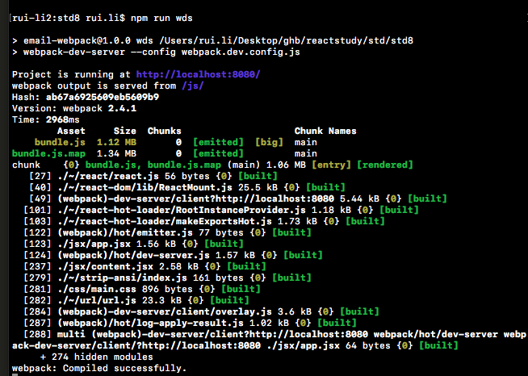
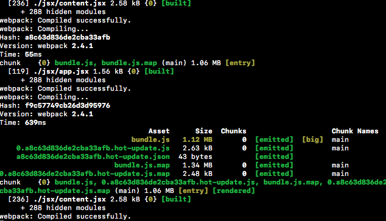
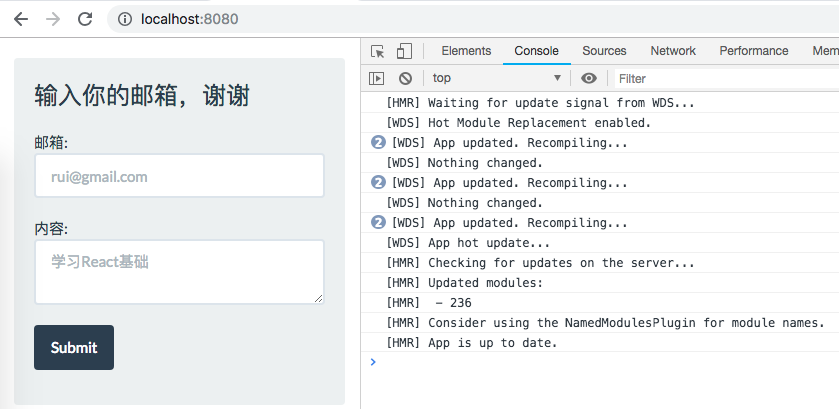

# 使用Webpack
------
#### 1. webpack的用途
* webpack是一款构建工具，它帮助我们完成下面几件事：
    - 打包js代码到尽量少的文件中，减少客户端请求个数，减少服务器端压力，减少用户等待加载时间。
    - 处理模块之间的依赖关系，它可以处理三种类型的js模块，所以不必担心模块类型混用。
    - 从开发环境“整理好”各个部分，以便部署使用。

* webpack会分析项目的依赖关系，确保：
    - 所有依赖按照正确顺序加载
    - 所有依赖只加载一次
    - js被打包到尽量少的文件中
    - 代码分割和资源哈希

* 本小节只会讲解React项目中如何加入webpack，以及一些基础配置的使用，更多功能与概念推荐直接查看[webpack官网文档](https://webpack.js.org/guides/getting-started/)

#### 2. js模块介绍
* CommonJS (使用`require() module.exports`语法)，用于服务器端(例如：Nodejs)，是同步方式加载模块
* AMD (使用`require([moduleName],callback) define(fn)`语法)，是异步方式加载模块
* ES6（ECMA2015）（使用`improt  from 'path' export`语法），是js语法层面的模块定义，在服务器端和浏览器通用。
* CommonJS 模块输出值的拷贝，ES6 模块输出值的引用
* CommonJS 模块运行时加载，ES6 模块编译时输出接口


#### 3. 环境安装
* 前提：当你npm install fail 时,可以尝试下列步骤：
    - `npm ls --depth 0 -g` 看下全局安装的包有哪些，会不会与本地冲，按理说不会冲突。
    - `npm cache verify` 验证缓存数据的有效性和完整性，清理垃圾数据
    - 删掉package-lock.json
    - `npm cache clean --force` 强制清除npm缓存
    - 保持耐心，可能要重复几次，跟公司网络也可能有关

*  让我们从头开始吧
    - 新建一个项目文件夹：`mkdir std8 && cd std8`  
    - 初始化并生成`package.json` ：`npm init -y` 
    - 通过`npm install --save-dev` 安装下列库:
        - `react 与 react-dom` 不再通过拷贝方式和`<script></script>`手动加入到html的方式使用`React`了，我们会通过模块导入语法使用React。
        - `babel-core ，babel-loader 与babel-preset-react` 处理ES6-ES5,JSX转换成JS
        - `webpack` 打包工具
        - `css-loader 与style-loader` css加载器使得可以用js解析加载css，style加载器将css添加到html页面
        - `react-hot-loader` react的热模块替换加载器（Hot Module Replacement），让代码更新后不必刷新浏览器来重新加载查看效果，提高开发效率
        - `webpack-dev-server` wds是一台Express开发服务器，它支持HMR
    - 安装完上面的10个库后，我们就可以继续搭建项目结构了。值的注意的是安装时可能遇上 *前提* 里讲的问题，可以参考里面的解决办法。
    - 新建三个文件夹，分别是：`js css 和 jsx`，再建一个`index.html`。看，这和我们以往的项目没有什么区别。
    - 快速配置`package.json`的babel预设以及单独使用`webpack`的npm script，我们保存命令`"build": "./node_modules/.bin/webpack -w"`
    - 接下来需要新建一个`webpack`的配置文件`webpack.config.js`，必备的配置会告诉webpack如何进行工作，就像todo list。
    - 配置完成后，就可以编写常规代码了，之后就是简单的运行命令，打开本地服务器预览界面。

#### 4. webpack.config.js
```javascript
const webpack = require('webpack');//导入webpack

module.exports = {
  entry:[//设置入口
    'webpack-dev-server/client/?http://localhost:8080',//添加wds入口
    './jsx/app.jsx'//添加开始打包的入口文件
  ],
  output:{//添加打包输出的路径
      publicPath: 'js/',//设置wds需要访问的路径
      path: __dirname + '/js/',//设置输出的bundle.js的路径
      filename: 'bundle.js'//设置输出的打包文件名
  },
  devtool: '#sourcemap',//开启devtool，生成sourcemap在调试时使用
  module: {
      rules: [
        { 
          test: /\.css$/, 
          use: [
            'style-loader',//将css导入页面中
            'css-loader'//将css注入页面
            ] 
        },
        {
          test: /\.jsx?$/,
          exclude: /(node_modules)/,
          use: [
            'react-hot-loader',//让HMR应用到所有jsx文件
            'babel-loader'
            ]//执行jsx转换为js
        }
      ]
  },
  devServer: {//设置Webpack-dev-server 为HMR模式
    hot: true
  },
  plugins: [new webpack.HotModuleReplacementPlugin()]//包含HMR插件
}
```
webpack.config.js的配置是多变和自主的，不同的应用场景需要的配置是不同的，而且包的版本也很重要，包的版本差异太则可能引起编译失败。

##### 5. 模块化代码
在jsx文件夹中添加2个文件app.jsx 和 content.jsx
与以往的代码不同的是我们需要导入React ReactDOM 才能使用
```javascript 
//content.jsx
const React = require('react');
const ReactDOM = require ('react-dom');
class Content extends React.Component {
...
}
module.exports = Content;

//app.jsx
require('../css/main.css');

const React = require('react');
const ReactDOM = require ('react-dom');
const Content = require('./content.jsx');
...
```

完整代码见：[std8](../std/std8)

运行结果：

* 编译：`npm run wds`



* 代码修改后HMR



* 页面更新（自动刷新页面）




[返回顶端](#使用Webpack) [返回目录](../README.md) 