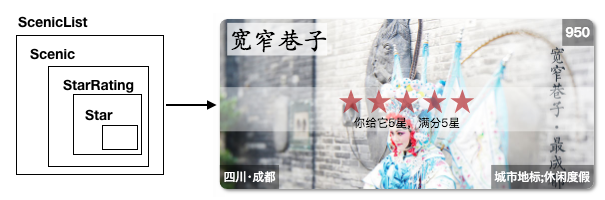

# 编码
------

编码过程我们也按照学习过程来一步步回顾。

#### 1. index.html

```html
<!DOCTYPE html>
<html>
<head>
    <meta charset="utf-8" />
    <meta http-equiv="X-UA-Compatible" content="IE=Edge,chrome=1" />
    <meta name="viewport" content="width=device-width, initial-scale=1.0 user-scalable=no" media="screen" />
    <title>scenic</title>
</head>
<body>
    <div id="app"></div>
</body>
</html>
```

添加`<div id="app"></div>` 作为React挂载虚拟DOM的真实DOM节点。index.html要做的事就结束了，简单吧。接下来写入口index.js

#### 2. index.js

```javascript
import React from 'react';
import ReactDOM from 'react-dom';
import { HashRouter } from 'react-router-dom';
import { Provider } from 'react-redux';
import storeFactory from './store';
import App from './components/App';

import './css/common.css';

const store = storeFactory();

ReactDOM.render(
  <Provider store={store}>
    <HashRouter>
      <App />
    </HashRouter>
  </Provider>,
  document.getElementById('app'),
);

if (module.hot) {
  module.hot.accept();
}

```

我们使用`<Provider store={store}>`来传递应用状态和用`<HashRouter>`来创建应用路由。最后将<App /> 挂载到真实节点。接下来添加APP组件。

##### 3.App.jsx

```javascript
import React from 'react';
import { Route, Switch } from 'react-router-dom';
import Menu from './ui/Menu';
import { Scenics } from './containers';

const App = () => (
  <div className="content">
    <Route component={Menu} />
    <Switch>
      <Route exact path="/" component={Scenics} />
      <Route path="/sort/:sort" component={Scenics} />
    </Switch>
  </div>
);

export default App;
```

App组件是整个应用的根组件，它由组件`<Menu />`和` <Scenics />`组成。这里的Menu将一直显示在页面中，通过`<Switch>`会显示不同路径下的Scenics组件。

##### 4. Menu 与 Scenics

```javascript
//<Menu />
const Menu = ({ match }) => (
  <div className="menu">
    <NavLink className="item" style={match.isExact ? selectedStyle : {}} to="/">热门</NavLink>
    <NavLink className="item" activeStyle={selectedStyle} to="/sort/title">名字</NavLink>
    <NavLink className="item" activeStyle={selectedStyle} to="/sort/rating">星数</NavLink>
  </div>
);
```
Menu组件中使用了`<NavLink>`来进行不同条件的选项显示。当选项被选中时，呈现选中的样式，以及导航到不同的路径，通过路径传递的`sort`参数来筛选相应的数据结果。

```javascript
//<Scenics />
export const Scenics = connect(
  ({ scenics }, { match }) => ({
    scenics: sortScenics(scenics, match ? match.params.sort : 'popularize'),
  }),
  dispatch => ({
    onRate(id, rating) {
      dispatch(rateScenic(id, rating));
    },
  }),
)(ScenicList);
```
Scenics是使用react-redux的connect函数生成的一个 *容器组件*，我们通过传递外部state对象，以及Router的match对象，经过sortScenics方法，返回一个对象`{scenics:value}`，最终转换为 UI 组件ScenicList的参数。再建立 UI 组件的参数到store.dispatch方法的映射，及是ScenicList组件的onRate事件。

##### 5. 一系列UI组件

我们的ScenicList组件是由若干Scenic组件组成，Scenic又是由StarRating和其他组件组成，StarRating划分到最小的Star组件。它们的关系大致是：



###### 5.1 Star

```javascript
//<Star />
const Star = ({ selected = false, onClick = f => f }) => (
  <div
    className={(selected) ? 'star selected' : 'star'}
    onClick={onClick}
    role="button"
    tabIndex="0"
  />
);
```
Star是星星组件，通过传递给他的参数，我们显示它是选中/未选中状态。以及点击事件。role与tabIndex属性是Airbnb的ESLint规范中强调的一些做法，具体可以查看[相关规则](https://github.com/evcohen/eslint-plugin-jsx-a11y/blob/master/docs/rules/no-static-element-interactions.md)。

###### 5.2 StarRating

```javascript
//<StarRating />
const StarRating = ({ starsSelected = 0, totalStars = 5, onRate = f => f }) => (
  <div className="star-rating">
    {[...Array(totalStars)].map((n, i) => (
      <Star
        key={window.parseInt(i.toString())} //用index当中key被认为是“反模式”，此处星星组件只是纯展示，不会有排序/增加等情况，所以可用。
        selected={i < starsSelected}
        onClick={() => onRate(i + 1)}
      />
    ))}
    <p>你给它{starsSelected}星，满分{totalStars}星</p>
  </div>
);
```

StarRating组件有3个参数，starsSelected选中的数量，totalStars总共的个数，以及onRate方法，通过总星星个数来渲染Star，并根据starsSelected来设置当前星星是否被选中。以及注册每个星星的onClick事件。

###### 5.3 Scenic

```javascript
//<Scenic />
class Scenic extends Component {
  render() {
    const {
      id, title, tag, popularize, background, address, rating, onRate,
    } = this.props;
    return (
      <div className="scenic" data-id={id}>
        
        <p className="title">{title}</p>
        <div className="starbox">
          <StarRating starsSelected={rating} onRate={onRate} />
        </div>
        <p className="popularize">{popularize}</p>
        <p className="tag">{tag}</p>
        <p className="address">{address}</p>
      </div>
    );
  }
}
```

###### 5.4 ScenicList

```javascript
const ScenicList = ({ scenics = [], onRate = f => f }) => (
  <div className="scenic-list">
    {(scenics.length === 0) ? <p className="no-tip">景区：0</p>
      : scenics.map(s => (
        <Scenic
          key={s.id}//利用景区的id值作为唯一的key，在后续重新排序时react根据key来确定是否是同一组件
          {...s}
          onRate={rating => onRate(s.id, rating)}
        />
      ))}
  </div>
);
```

##### 6. 状态与数据

使用redux来管理应用数据流，我们需要做下面几件事：

* 创建Action
* 创建store
* 添加中间件
* 创建Reducers

###### 6.1 数据结构

我们首先创建一个initialState.json用于存放应用初始状态：

```json
{
  "scenics": [
    {
      "id": "",
      "title": "",
      "tag": "",
      "address":"",
      "popularize": 0,
      "background": "",
      "rating":0
    }
  ],
  "fetching":"none"
}
```

可以看出我们的状态树由`scenics`和`fetching`组成，`scenics`存储景区数据，是个array。`fetching`表示当前数据状态，“none”表示未请求。

###### 6.2 创建store

```javascript
import { createStore, combineReducers, applyMiddleware } from 'redux';
import thunk from 'redux-thunk';
import { scenics, fetching } from './reducers';
import stateData from '../../data/initialState';

const logger = store => next => (action) => {
  console.groupCollapsed('dispatching', action.type);
  console.log('prev state', store.getState());
  console.log('action', action);
  const result = next(action);
  console.log('next state', store.getState());
  console.groupEnd();
  return result;
};

const saver = store => next => (action) => {
  const result = next(action);
  localStorage['redux-store'] = JSON.stringify(store.getState());
  return result;
};

const storeFactory = (initialState = stateData) => {
  const local = localStorage['redux-store'];
  return applyMiddleware(thunk, logger, saver)(createStore)(
    combineReducers({ scenics, fetching }), local ? JSON.parse(local) : initialState
  );
};

export default storeFactory;
```

storeFactory返回了store，并添加了三个中间件thunk, logger, saver功能，thunk来自`redux-thunk` 让应用可以创建异步ActionCreator，即返回的结果是一个函数，而不是对象，这个函数的表现形式如下：

```javascript
export const fetchScenicData = () => (dispatch, getState) => {...}
```
可以在这里进行一些异步操作，例如数据请求等。

logger中间件是自定义的，用于在控制台打印一些日志信息。

saver中间件是把应用State树通过localStorage方式保存在本地。

中间件通过`applyMiddleware()`方法添加进store。

工厂方法采用`const store = applyMiddleware()(createStore)(reducer, preloadedState)` 方式创建。

`combineReducers({ scenics, fetching })`将多个reducer合并为单个reducer。

`local ? JSON.parse(local) : initialState` 判断本地是否存在数据，若不存在就使用`initialState = stateData`即是initialState.json导入的初始化数据。

###### 6.2 数据请求

状态管理就是数据管理，回忆一下之前是怎样向服务器请求数据的？[std7](../../std/std7/menu)中我们使用了`fetch()`函数在组件的生命周期函数：`componentDidMount()`中，向服务器请求数据并在返回后修改了程序的State。那在redux中应该如何做呢？

我们知道redux中通过store.dispatch(Action)来分发Action，以达到更新State的目的，而Action Creator（动作生成器）是用来生成Action的方法，在ActionCreator中，我们封装了生成Action的细节，它包含了成功创建一个Action的所有逻辑，在这里应该存放所有和后端API交互逻辑相关的内容，所以我们可以在此执行“异步操作”（数据请求等）。

同步Action：


