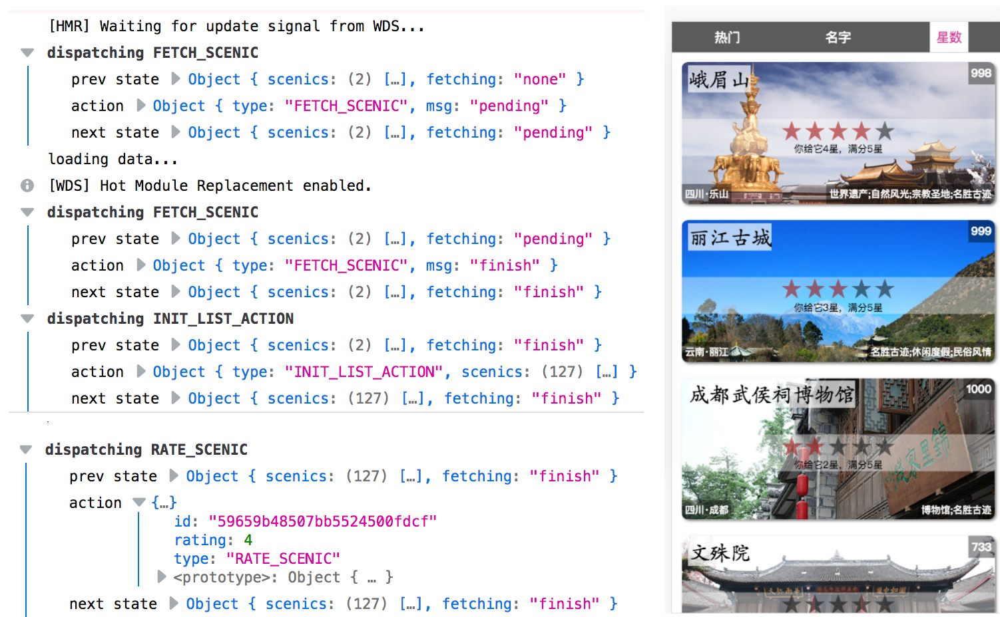

# 回顾/小结
------

##### 1. 运行结果

我们可以看到控制台的打印信息，state树的数据流变化，从最初的2个景区作为种子数据，开始FETCH_SCENIC，"none"-->"pending"-->"finish"。数据请求完成后，执行INIT_LIST_ACTION，景区数据更新为127个。

我选择某个景区点击星星进行打分操作（RATE_SCENIC）。

##### 2. 小结

通过这个小项目，回顾了React的基础知识和高级应用。在后续学习中可以当作参考。

##### 3. 完整代码

[code](../../std/std13)

