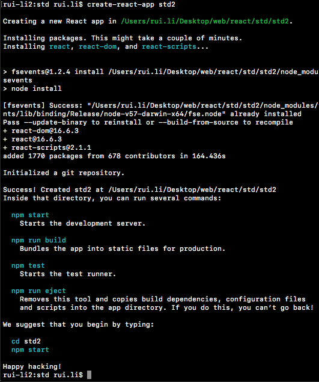
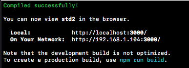
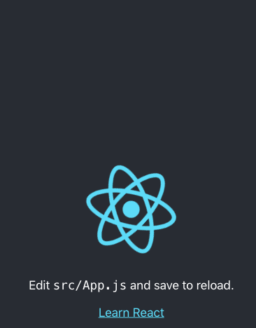

# 脚手架
------

脚手架帮助我们快速构建 React 开发环境，让我们可以更迅速开始coding...

#### 1. create-react-app
* Facebook 推出的
* `sudo npm install -g create-react-app` 全局安装
* 创建一个React项目：`create-react-app std2` 成功后出现下面的打印信息：

* 运行`npm start` 

