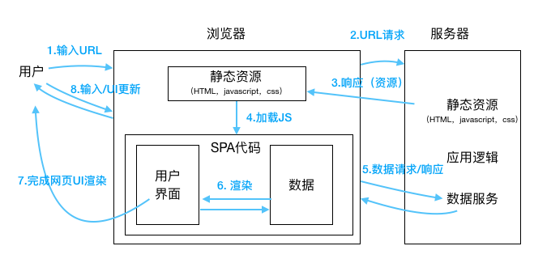

# 准备工作
------
#### 1. 心里准备
##### 1.1 为什么要学习React？
* React是一个前端UI组件库，UI组件通过React使用Javascript创建，而非特殊模版语言创造。
* React解决管理视图对数据变更的响应问题，将UI作为函数，数据作为参数调用函数，渲染可预测是视图。
* React采用虚拟DOM的架构使得Web页面渲染瓶颈得以优化，性能提升。

##### 1.2 为什么要学习JSX？
* JSX是React.createElement()的语法糖，它简化了创建UI组件的编写方式。
* JSX --> 编译器（babel）--> JS --> 浏览器

#### 2. 环境准备
* Node
* npm
* react
* babel
* webpack

#### 3. 其他注意事项
* SPA 架构

* React技术栈：
    - 数据模型与后端：Redux
    - 路由库：React Router
    - 组件集合库: React-Bootstrap
